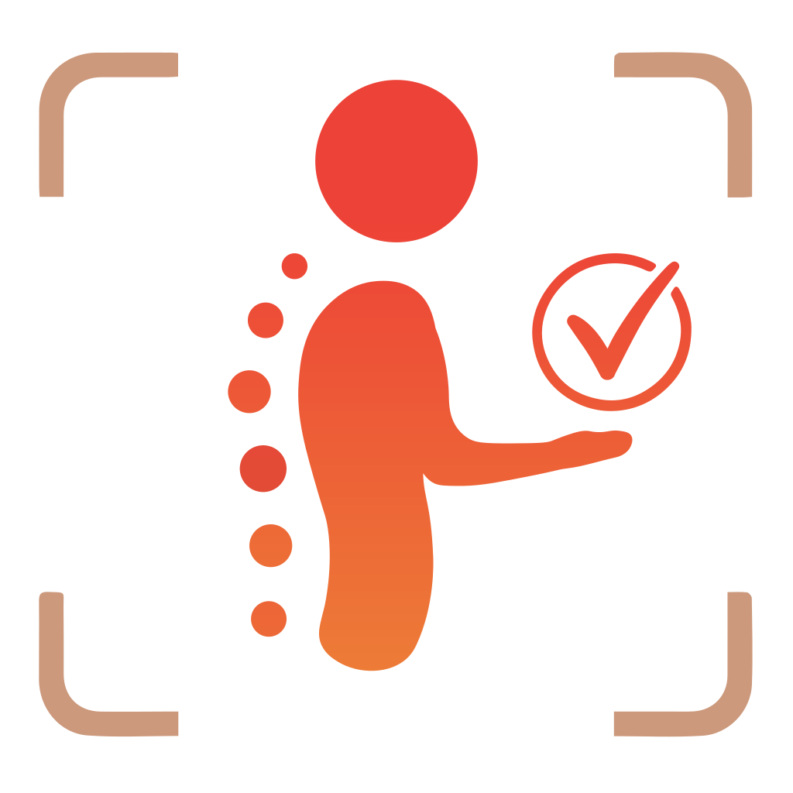

<!-- Logotipo de la organización -->

    

 

<!-- Información del proyecto -->

    
    
    

 

<!-- Introducción al proyecto -->
## <samp>Introducción</samp>
<i>
    <b>Sistema de Gestión & Diagnóstico de Riesgos Ergonómicos (Hunter Project)</b>, es un sistema integral desarrollado para el cumplimiento de la <b>NOM-036-1-STPS-2018</b> que automatiza la evaluación ergonómica mediante     un pipeline de detección, validación & generación de reportes. El Backend procesa y analiza videos a través de Runpod, estos son proporcionados desde las aplicaciones web y móviles.
</i>

  

<!-- Sistemas desarrollados -->
## <samp>Sistema</samp>

#### MOBILE APP
> [!NOTE]
> Pendiente...

<i>― Aplicación desarrollada por: <a href='https://github.com/Juanita456'><b>Alma Domínguez</b></a></i>

#

#### WEBSITE APP
> [!NOTE]
> Haz clic en la imagen para acceder.

    

<i>― Aplicación desarrollada por: <a href='https://github.com/ed-of-astora'><b>Ed Rubio</b></a></i>

#

#### BACKEND & PIPELINE DE EVALUACIONES
> [!NOTE]
> Pendiente...

<i>― Sistema desarrollado por: <a href='https://github.com/Camcapxi'><b>Jordan Vidaña</b></a></i>

 

<!-- Agradecimientos generales -->
## <samp>Agradecimientos</samp>
<i>
    Esta sección es un reconocimiento sincero a aquellas personas y entidades que contribuyeron significativamente al desarrollo de este proyecto.
    Nuestra gratitud se extiende tanto a quienes brindaron su asesoría técnica como a quienes ofrecieron el soporte personal necesario para su realización.
</i>

  

# <!-- Notita final, hehe... -->
#### ***"Beneath the hollow sky, the last embers whisper. Those who linger shall be consumed, yet the wanderer walks onward, unyielding to the silence of gods."***
